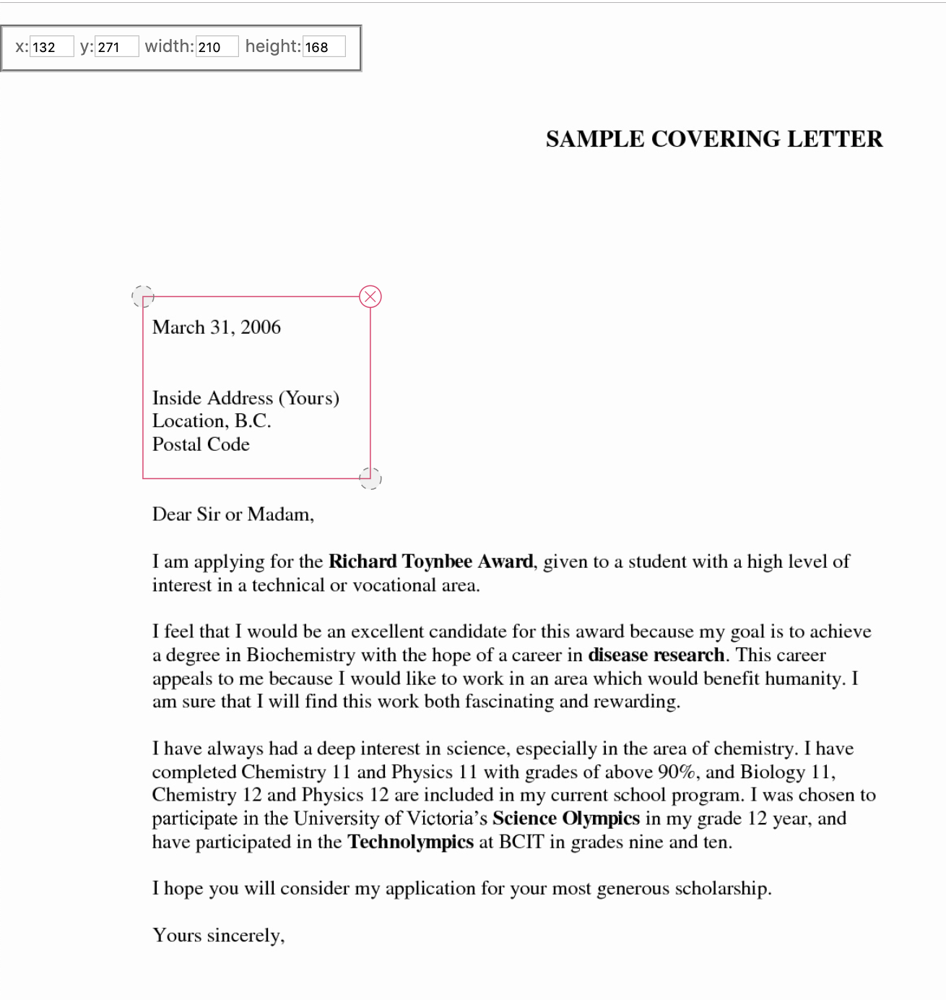

# JavaScript-D3-Object-Detection-Example
JavaScript D3 Object Detection Bounding Box Draw Example
The following example is giving to draw bounding boxes for the Object Detection of computer vision, Tensorflow, Deep learning etc. I didn't find something beautiful to draw dragable bounding boxes on images therefore i created one example.

# Screen Shot of index.html

